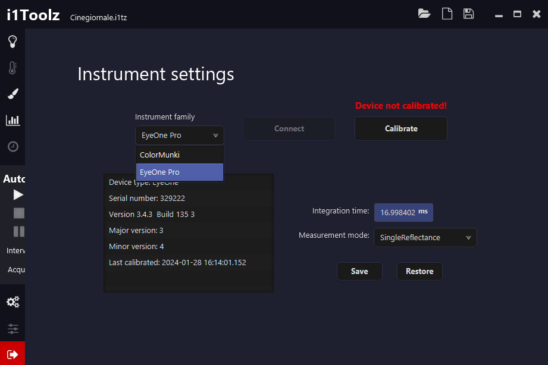
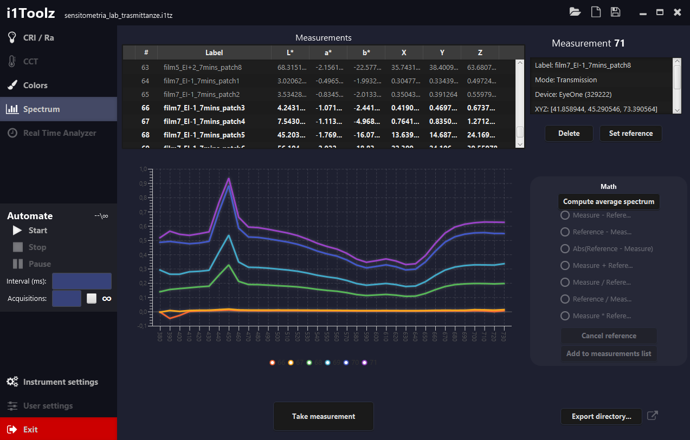
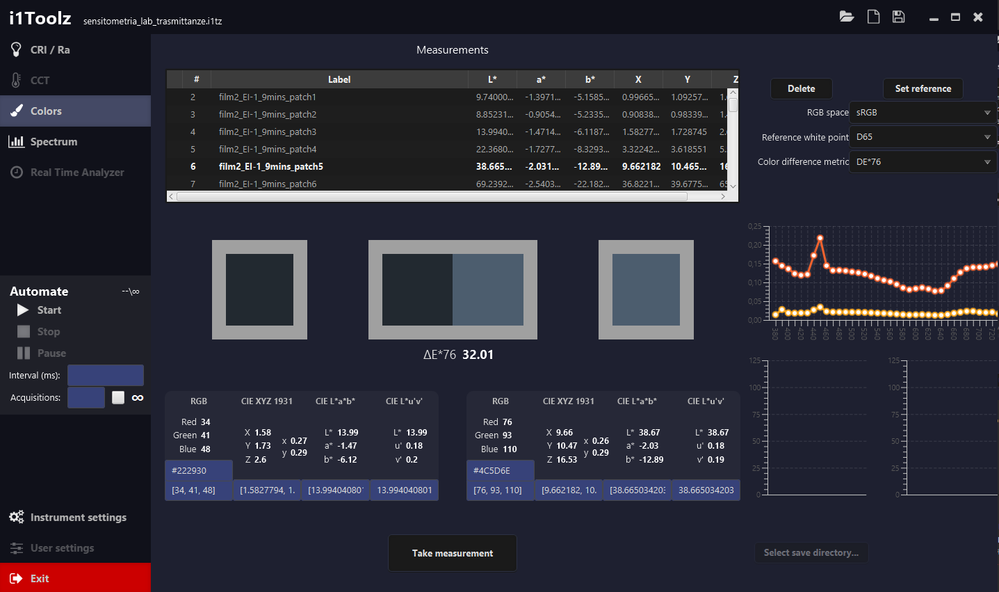
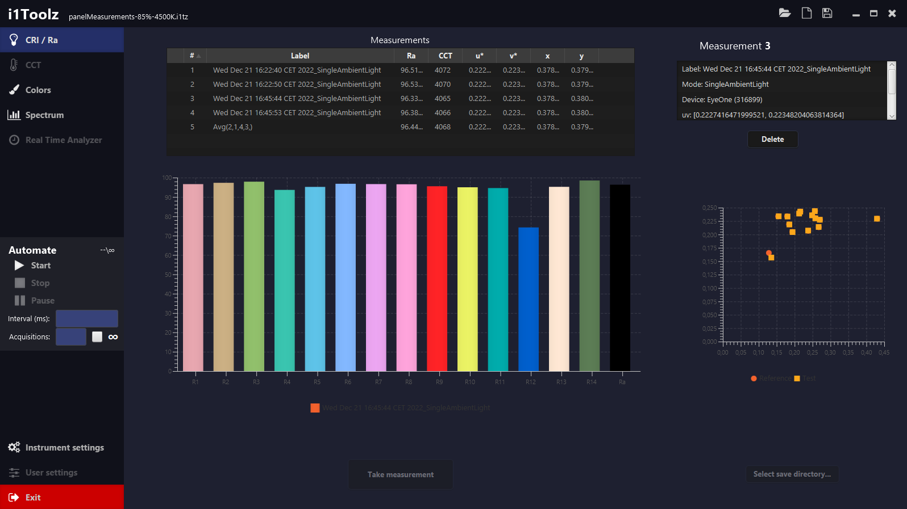
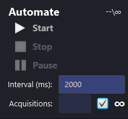

# i1Toolz
### JavaFX-based software for spectral readings using the EyeOne Pro spectrophotometer
i1Toolz is a simple software currently under development that enables X-Rite's EyeOne Pro spectrophotometer
to perform actual spectral readings.

## Disclaimer
<b>i1Toolz is currently under development, use it at your own risk!</b> 
I began working on i1Toolz since I had the need to perform spectral readings for cheap, using an EyeOne Pro device I had
lying around, but during the last year I didn't have enough spare time to keep working on this project. I didn't want
to publish this piece of software until it would be neat and in good working conditions, but since I won't probably have
time to keep developing it, I'm publishing it here so that it can be of help for anyone who might need at least its basic
functionalities, or wish to fix some bugs and improve it a little.

# Requirements
As of now, i1Toolz only runs on Windows x86/x64. 
In order to use i1Toolz you need to install both the device drivers and its DLLs, the easiest way to do so is to download
and install X-Rite's i1Match software from [their own website](https://www.xrite.com/it-it/service-support/downloads/x/x-rite_device_services_v3_1_133_pc).
<b>I cannot distribute X-Rite's DLLs and device drivers since they are copyrighted, that's why you need to retrieve them
through their website.</b>
### Supported devices
Currently only the EyeOne Pro version 1 is fully supported. The ColorMunki does work, but it's not reliable and leads to
frequent crashes, feel free to try it if you have one lying around, but I suggest you not to buy one for the sole purpose
of using it with this piece of software.

# Development
As stated, I doubt that I will have much time to keep working on this, but I will do my best to publish a bit of 
documentation in the near future and I will also add comments to the source code, as soon as I'll have some spare time.
## Bug reporting
I'm aware of the gazillions of bugs present in this piece of software, but as stated is a prototype that I'm not sure
I'll be able to keep working on. Feel free to contact me bug reporting or anything, I'll be pleased to catch up with you,
but don't expect for me to fix all the bugs immediately if at all. I'm sorry.
## Not implemented features
If a button is greyed out, it is possible that the specific feature is not implemented yet.

# Usage
## Connection and calibration
Connection, calibration and selection of measurement mode are performed through the <i>Instrument Settings</i> page.
 
1) Connect your device
2) make sure the device drivers are installed
3) Select your instrument family from the dropdown menu, after a while it should connect and display the information
   about the connected device.
4) Select the measurement mode from the dropdown menu and hit <i>Save</i>
5) Click on <i>Calibrate</i> and follow the instructions.

Everytime the measurement mode is changed, a new calibration should be performed.

# Perform a measurement
You can perform a measurement by clicking on the "Take measurement" button in the desired page, or using the physical
button on the side of the instrument.

### Transmission mode
The EyeOne Pro and the ColorMunki don't have the ability to perform transmittance readings, so to use the transmission
mode you need to use and calibrate against a white light source which is used as a reference. The light source must not
get to zero energy anywhere from 380 to 730 nm, otherwise the calibration won't succeed.

## Spectral measurements
Spectral measurements are performed in the <i>Spectrum</i> page.
 
- <b>Showing multiple spectrums at once:</b> To show multiple spectrums, simply hold CTRL or Shift key and select the
  spectrums you wish to display.
- <b>Rename readings</b>: to rename a measurement, double click on the measurement name in the "Label" column, edit it
and press Enter.
- <b>Mathematical operations:</b> some basic mathematical operations can be performed between a reference spectrum
and all the others.
   1) Select the measurement you wish to use as a reference.
   2) Click on the "Set reference" button, the selected measurement is highlighted.
   3) Select the desired operation from the Math panel on the right.
   4) All the spectrums are showed relatively to the selected operation.
   - Click on "Cancel reference" to disable the mathematical operations.
   - Click on "Add to measurements list" to add the current result to the measurements.
- <b>Compute the average</b>: to compute the average select the spectrums you wish to average and click on the "Compute
  average spectrum" button.
- <b>Export to CSV</b>: spectral readings can be exported to CSV by selecting a directory using the "Export directory"
button on the bottom right portion of the window.
  - <b>All the changes in the measurement table reflects immediately in the export directory</b>: if you delete a
   measurement, the corresponding CSV file will be deleted; if you add a measurement, a new file is created; if you
    rename a measurement, the corresponding CSV file will be renamed. You don't need to export them again until the
    window is closed.
- <b>Cut/Copy/Paste</b>: measurements can be cut, copied or pasted by right clicking on the measurements list. You can
copy a measurement from a project and paste it into another one.
- <b>Copy chart</b>: you can copy the chart as an image by right-clicking on it a clicking on "Copy", you can paste it
anywhere as a bitmap.
    
## Color measurements
 
Each reflectance or transmittance measurement is listed also in the Colors tab, where colorimetric coordinates and
measurements are computed. 
Pressing on "Set reference" sets the selected measurement as reference and places it on the left side, and the DE76
between the selected and the reference measurement is shown. 
A preview (always assuming sRGB as reference color space) is shown of the selected color(s), but isolated in a 50% gray
background, and side to side.
### Known bugs and not implemented features
The lower right plots should've shown the ab and u'v' coordinates, but it has not been implemented. The export
function has not been implemented. 
Other RGB spaces, white points and colorimetric difference metrics have not been implemented yet. 
The RGB space is used for computing the RGB color, if the color lies outside the gamut, a wrong hex code is shown,
please pay attention until that's fixed.

## CRI / RA measurements
 
Measurements taken in emission or incident light mode are also listed in the CRI / Ra tab. The score for each of the 14
patches is plotted, and the total Ra value is shown, along with the CCT, xy and u'v' coordinates.
The plot on the right shows the distribution of the targets and
the references in u'v' space. 
The export function has not been implemented.

## Automation
 
Measurements can be taken automatically using the Automation panel on the left, and indicating a number of acquisition
(if the infinite flag is enabled, infinite measurements are taken until the automation is stopped or paused) and
a time interval in milliseconds. If the interval is shorter than the time needed for the measurement to be taken,
the measurement time will prevail.